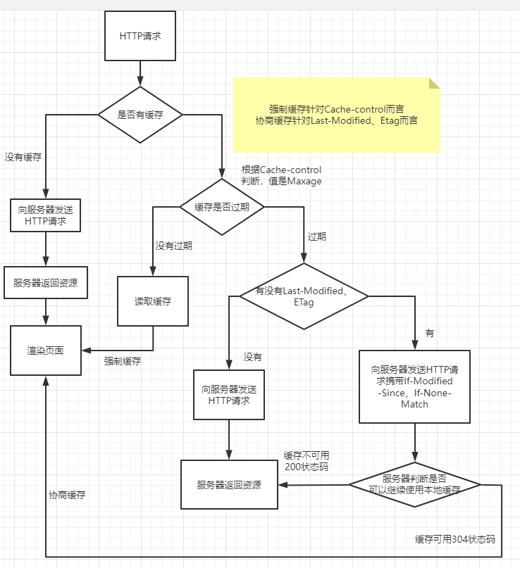

## HTML

### 校验能否支持Vue

在index.html中运行校验浏览器版本的代码，vue项目不支持，浏览器提示

## 浏览器引擎

| 浏览器  | 渲染引擎         | JS引擎         |
| ------- | ---------------- | -------------- |
| IE      | Trident          | Chakra         |
| Edge    | EdgeHTML         | Chakra         |
| Firefox | Gecko            | SpiderMonkey   |
| Chrome  | Webkit  -> Blink | V8             |
| Safri   | Webkit           | Javascriptcore |
| Opera   | Presto -> blink  | Carakan        |

### CSS兼容性

厂商前缀：谷歌-webkit-、火狐-moz-、IE-ms-、欧朋-o-

### !DOCTYPE html 是干什么的，有什么用

1、声明文档类型是html5类型的文档。2、声明了则是标准模式，兼容ie高版本；不声明则是混杂模式，兼容ie低版本。

XHTML 1.0是一种在HTML 4.0基础上优化和改进的的新语言，目的是基于XML应用。 XHTML是一种增强了的HTML,它的可扩展性和灵活性将适应未来网络应用更多的需求

XML 指可扩展标记语言，常用来做配置文件

XML 被设计用来传输和存储数据。

HTML 被设计用来显示数据。

### 提高页面性能
```
2.1、图片压缩、合并（精灵图）、使用字体图标代替小图片、使用base64、图片懒加载
2.2、css、js的压缩、封装复用
2.3、减少重排操作，例如使用transform书写动画效果，在for循环结束后再去操作dom等
2.3、使用CDN网络托管
2.4、数据懒加载、数据按需加载（上拉加载）、分页
2.5、路由懒加载
2.6、利用缓存来缓存文件
2.7、频繁触发的事件进行防抖和节流
2.8、异步加载
2.9、减少闭包，递归优化，使用高效的算法
2.10、webpack优化：去除无用代码treeShaking、组件按需加载、使用chunck、模板预编译等
2.11、字库用gb2312不要utf-8，一个汉字少一个字节
```
### 谈谈你对H5的理解

Html5是Web中核心语言HTML的规范，是 HyperText Markup Language 5 的缩写，H5提供新的标签
元素，使代码变的更有语义；提供了大量api，如本地存储、离线存储、webworker、websocket、
filereader、地理定位、拖拽等；提供了更加酷炫的CSS3新特性，如过渡、变形、动画、阴影、渐变
等。

### 浏览器从输入网址都看到网页都发生了什么？

4.1、域名解析成ip地址

4.2、客户端发送一个带有SYN标志的数据包给服务端（三次握手，第一次）

4.3、服务端收到后，回传一个带有SYN/ACK标志的数据包以示传达确认信息（三次握手，第二次）

4.4、客户端再回传一个带ACK标志的数据包，代表握手结束，连接成功（三次握手，第三次）

4.5、服务端处理数据并返回数据

4.6、客户端请求关闭连接（四次挥手，第一次）

4.7、服务端确认是否还有数据要传输（四次挥手，第二次）

4.8、服务端没有要传输的数据了，准备关闭连接（四次挥手，第三次）

4.9、客户端断开连接（四次挥手，第四次）

4.10、浏览器解析HTML，生成DOM树，解析CSS，生成CSS规则树

4.11、DOM树和CSS规则树合并成渲染树，开始渲染

4.12、执行JavaScript脚本

### 重绘和重排

重排也叫回流，当元素因为规模尺寸，布局，隐藏等改变而需要重新构建时则成为重排。
重绘：一些元素需要更新属性，而这些属性只是影响元素的外观，风格，而不会影响布局则叫重绘。
重绘不一定重排，但是重排一定重绘。

浏览器下载完毕所有的页面组件--包括html标记，js，css，图片后，会解析并生成两个内部的数据结构：

    - DOM树
    - 渲染树

DOM树都很熟悉了，而渲染树就是DOM树中每一个节点所对应的frame或者box所组成的（不包括隐藏的DOM元素）。DOM的变化影响了元素的几何属性的时候，比如大小宽高，从而影响了其他元素的几何属性和位置，这个时候浏览器就需要重新构造渲染树，这个过程就叫做重排，完成重排以后，浏览器再重新绘制受影响的部分到屏幕中，这个就叫做重绘。有的的变化不会影响几何属性的，比如改变背景色，就只会发生重绘，而不需要重排，因为元素的布局并没有发生改变，但这两种操作都是代价昂贵的，虽然浏览器本身会进行优化，但是在编写代码的时候仍然需要最少的去进行这样的操作。

### 浏览器解析流程
```
* 浏览器将获取的 HTML 文档解析成 DOM 树；
* 处理 CSS 标记，构成层叠样式表模型（CSSOM）；
* 将 DOM 和 CSSOM 合并为渲染树（rendering tree）；
* 渲染树的每个元素的内容都是计算过的，称之为 布局layout；
* 将渲染树上的各个节点绘制到屏幕上，称之为 绘制painting；
```

### 高频dom操作和页面性能优化探索
```
一、DOM操作影响页面性能的核心问题

通过js操作DOM的代价很高，影响页面性能的主要问题有如下几点：

    访问和修改DOM元素
    修改DOM元素的样式，导致重绘或重排
    通过对DOM元素的事件处理，完成与用户的交互功能
```

### 缓存 🎈

强制缓存：请求头设置cache-contro，缓存没有过期，渲染页面
  max-age缓存的时间
  no-cache：不使用本地缓存。需要使用缓存协商，先与服务器确认返回的响应是否被更改，如果之
  前的响应中存在ETag，那么请求的时候会与服务端验证，如果资源未被更改，则可以避免重新下载。
  no-store：直接禁止浏览器缓存数据，每次用户请求该资源，都会向服务器发送一个请求，每次都
  会下载完整的资源。
  public：可以被所有的用户缓存，包括终端用户和CDN等中间代理服务器。
  private：只能被终端用户的浏览器缓存，不允许CDN等中继缓存服务器对其缓存。

协商缓存：请求头设置last-modified/etag

  If-Modified-Since、If-None-Match 判断是否可以使用本地缓存

  1.Etag要优于Last-Modified。Last-Modified的时间单位是秒，如果某个文件在1秒内改变了多次，那么
  他们的Last-Modified其实并没有体现出来修改，但是Etag每次都会改变确保了精度；
  2.在性能上，Etag要逊于Last-Modified，毕竟Last-Modified只需要记录时间，而Etag需要服务器通过算
  法来计算出一个hash值；
  3.在优先级上，服务器校验优先考虑Etag。

### H5缓存

  本地存储：localStorage永久存储、sessionStorage临时存储
  离线缓存：在html标签上设置 manifest 属性 引入cache文件（CACHE缓存文件，NETWORK不缓存文
  件，FALLBACK当资源不可访问时，代替的文件）

### 更新缓存文件

  1、更新manifest文件；
  2、通过javascript操作：window.applicationCache.update()；
  3、清除浏览器缓存；
  4、带版本号，根据版本号判断。

### Cookie可以带哪些属性
```
chrome控制台的application下可查看:
Cookie是由服务器端生成，浏览器会将Cookie的key/value保存到某个目录下的文本文件内，下次请求同一网站时就发送该Cookie给服务器。每个cookie除了name名称和value值这两个属性以外，常用属性还有：expires过期时间、 path路径、 domain域、以及 secure安全、HttpOnly属性
1. name : 字段为一个cookie的名称。
2. value : 字段为一个cookie的值。
3. domain : 字段为可以访问此cookie的域名。
4. path : 字段为可以访问此cookie的页面路径。
比如domain是abc.com,path是/test，那么只有/test路径下的页面可以读取此cookie。
5. expires/Max-Age : 字段为此cookie超时时间。
6. Size : 字段 此cookie大小。
7. http : 字段 cookie的httponly属性。若此属性为true，则只有在http请求头中会带有此cookie的信息，而不能通过document.cookie来访问此cookie。
7.1 如果在Cookie中设置了”HttpOnly”属性，那么通过后台程序读取，JS脚本将无法读取到Cookie信息，这样能有效的防止XSS攻击。
7.2 但是设置HttpOnly属性，Cookie盗窃的威胁并没有彻底消除，因为cookie还是有可能传递的过程中被监听捕获后信息泄漏。
8. secure: 字段 设置是否只能通过https来传递此条cookie
```

### cookie 和 session 的区别

cookie是客户端的，session是服务端的。cookie存储于客户端，记录web服务器的信息，每次上网时都会先查看对应的cookie信息，比如购物时，使用cookie记录购物车信息。session是记录客户机的信息，SessionID是session的唯一标识，使用session可以记录客户端的请求等。

### script>和link标签对DOM解析和渲染的影响

```
1、<script>标签会阻塞DOM解析和渲染
大家应该都知道<script>标签的加载、解析和运行都会阻塞DOM的解析和渲染。
这是因为js可以操作DOM，浏览器为了防止渲染过程出现不可预期的结果，
让GUI渲染线程和js引擎线程互斥，即解析器在遇到<script> 标记时会立即解析并执行（或请求）脚本。
文档的解析将停止，直到脚本执行完毕后才会继续。

<script>标签会阻塞DOM的解析，我们有可能会获取不到页面元素：

2、<link>标签不会阻塞DOM解析但会阻塞DOM渲染
DOM的解析和CSSOM的解析是一个并行的过程。
两者互不影响。两者解析完成之后，会合并生成render tree，
之后就是layout和paint阶段，渲染到页面中。
```


## 项目介绍

### SCE运维平台

节点状态管理机，判断当前节点的状态，不能进行操作的按钮状态设为disable，支持多选操作

性能优化，由于后端会返回几千条数据，每条数据包含的内容需要写一些逻辑进行处理，如果全都进行处理的话，页面会很卡顿。我做的优化就是进行分页处理，当前页面没有展示的数据不对它进行渲染。

使用render函数对节点进行扩展展示

### 移动端ARM服务器

vant 组件，对节点进行重启与关机的操作

### 预案系统

利用插槽占位符，实现选择产品线需求，无需修改project外的架构，对外层内容进行修改，

子组件，需要实现原子预案批量生成，在一个modal弹出框中，首先填写域名或IP，然后再写一个预案名称前缀，点击批量生成，请求后端接口，后端返回数据，根据返回的数据展示可以批量生成的预案

使用fetch对请求进行封装，删除节点功能，后端swagger可以，但是前端调用接口会报500，对照请求头自己封装了一下，改了一下context-type

this.$parent.$parent.$parent => eventBus

## 设计模式

### 发布订阅模式

发布订阅模式包含三部分内容，发布者、订阅者和数据处理中心。订阅者把自己想监听的事件和回调函数信息写入到数据处理中心去；当事件触发时，发布者发布该事件到数据处理中心，由数据处理中心统一执行订阅者写入到数据处理中心对应事件的回调函数。

比如A组件需要向B组件传递数据，通过发布订阅模式来实现的思路是：

在B组件里添加（on，事件监听）一个事件订阅，监听的事件名称和回调函数；
当A组件需要给B组件传递数据时，可发布（emit）对应的事件名称并携带相应的数据,数据处理中心根据相应的事件执行回调函数并传递数据给B组件

定义数据处理中心
用来存储事件和回调函数信息

```javascript
class Emitter {
  constructor() {
    // 数据处理中心，用来存储事件和回调函数信息
    this.handlers = {}
  }
}
```

实现订阅功能
需要传入两个参数，订阅的事件名称和事件触发时的回调函数

```javascript
// 订阅
on(eventName, fn) {
  if (typeof fn !== "function") { console.error('fn must be a function') }
  if (!this.handlers[eventName]) {
    this.handlers[eventName] = []
  }
  this.handlers[eventName].push(fn)
}
```

实现发布功能
遍历数据处理中心的数据，找到并执行对应事件名称的回调函数

```javascript
// 发布
emit(eventName) {
    const fns = this.handlers[eventName]
    if (fns && fns.length) {
        // arguments，携带一些数据信息；将arguments函数参数列表（类数组对象）转为数组
        const args = [].slice.call(arguments)
        args.shift() // 参数去掉事件名称
        fns.forEach((fn) => {
            // 给回调方法传参
            fn.apply(null, args)
        })
    }
}
```

取消订阅
删除数据处理中心数组中对应事件的回调函数

```javascript
// 注销订阅
off(eventName, fn) {
    // 若是没有传参，注销所有的订阅
    if (!arguments.length) {
        this.handlers = {};
        return this;
    }
    const fns = this.handlers[eventName]
    if (!fns) return
    // 若是只传eventName，不传fn，删除对应事件名称下的所有回调函数
    if (arguments.length === 1) {
      delete this.handlers[eventName]
        return
    }
    if(fns && fns.includes(fn)){
        fns.splice(fns.indexOf(fn), 1)
    }
}
```

完整代码如下：
```javascript
class Emitter {
    constructor() {
        // 数据处理中心，用来存储事件和回调函数信息
        this.handlers = {}
    }
    // 订阅
    on(eventName, fn) {
        if (typeof fn !== "function") { console.error('fn must be a function') }
        if (!this.handlers[eventName]) {
            this.handlers[eventName] = []
        }
        this.handlers[eventName].push(fn)
    }
    // 发布
    emit(eventName) {
        const fns = this.handlers[eventName]
        if (fns && fns.length) {
            // arguments，携带一些数据信息；将arguments函数参数列表（类数组对象）转为数组
            const args = [].slice.call(arguments)
            args.shift() // 参数去掉事件名称
            fns.forEach((fn) => {
                // 给回调方法传参
                fn.apply(null, args)
            })
        }
    }
    // 注销订阅
    off(eventName, fn) {
        // 若是没有传参，注销所有的订阅
        if (!arguments.length) {
            this.handlers = {};
            return this;
        }
        const fns = this.handlers[eventName]
        if (!fns) return
        // 若是只传eventName，不传fn，删除对应事件名称下的所有回调函数
        if (arguments.length === 1) {
          delete this.handlers[eventName]
            return
        }
        if(fns && fns.includes(fn)){
            fns.splice(fns.indexOf(fn), 1)
        }
    }
}

module.exports = new Emitter()
```

代码示例
A组件需要向B组件传递数据

B组件
```javascript
// B组件
import emitter from 'emitter'
export default {
  data() {
    return {
      pageIndex: 1
    }
  },
  created() {
    // 添加'getAdata'事件订阅
    emitter.on('getAData' + this.pageIndex, this.getAData.bind(this))
  },
  // 路由页面销毁
  destroyed() {
    emitter.on('off' + this.pageIndex)
  },
  methods: {
    getAData(data) {
      console.log(data.info, '获取到A组件传给B组件的数据')
    }
  }
}
```
A组件
```javascript
// A组件
import emitter from 'emitter'
export default {
  data() {
    return {
      pageIndex: 1
    }
  },
  created() {
    setTimeout(() => {
      // 发布'getAdata'事件并携带数据
      emitter.eimit('getAData' + this.pageIndex, {
        info: 'A组件发送给B组件的数据'
      })
    }, 2000)
  }
}
```

### 后端一次给你 10 万条数据，如何优雅展示

直接渲染,最直接的方式就是直接渲染出来，但是这样的做法肯定是不可取的，因为一次性渲染出10w个节点，是非常耗时间的，咱们可以来看一下耗时，差不多要消耗12秒，非常消耗时间

```javascript
const renderList = async () => {
    console.time('列表时间')
    const list = await getList()
    list.forEach(item => {
        const div = document.createElement('div')
        div.className = 'sunshine'
        div.innerHTML = `<span>${item.text}</span>`
        container.appendChild(div)
    })
    console.timeEnd('列表时间')
}
renderList()
```

setTimeout分页渲染，这个方法就是，把10w按照每页数量limit分成总共Math.ceil(total / limit)页，然后利用setTimeout，每次渲染1页数据，这样的话，渲染出首页数据的时间大大缩减了

```javascript
const renderList = async () => {
    console.time('列表时间')
    const list = await getList()
    console.log(list)
    const total = list.length
    const page = 0
    const limit = 200
    const totalPage = Math.ceil(total / limit)

    const render = (page) => {
        if (page >= totalPage) return
        setTimeout(() => {
            for (let i = page * limit; i < page * limit + limit; i++) {
                const item = list[i]
                const div = document.createElement('div')
                div.className = 'sunshine'
                div.innerHTML = `<span>${item.text}</span>`
                container.appendChild(div)
            }
            render(page + 1)
        }, 0)
    }
    render(page)
    console.timeEnd('列表时间')
}
```
requestAnimationFrame，使用requestAnimationFrame代替setTimeout，减少了重排的次数，极大提高了性能，建议大家在渲染方面多使用requestAnimationFrame

```javascript
const renderList = async () => {
    console.time('列表时间')
    const list = await getList()
    console.log(list)
    const total = list.length
    const page = 0
    const limit = 200
    const totalPage = Math.ceil(total / limit)

    const render = (page) => {
        if (page >= totalPage) return
        // 使用requestAnimationFrame代替setTimeout
        requestAnimationFrame(() => {
            for (let i = page * limit; i < page * limit + limit; i++) {
                const item = list[i]
                const div = document.createElement('div')
                div.className = 'sunshine'
                div.innerHTML = `<span>${item.text}</span>`
                container.appendChild(div)
            }
            render(page + 1)
        })
    }
    render(page)
    console.timeEnd('列表时间')
}
```
文档碎片 + requestAnimationFrame

文档碎片的好处

1、之前都是每次创建一个div标签就appendChild一次，但是有了文档碎片可以先把1页的div标签先放进文档碎片中，然后一次性appendChild到container中，这样减少了appendChild的次数，极大提高了性能

2、页面只会渲染文档碎片包裹着的元素，而不会渲染文档碎片

```javascript
const renderList = async () => {
    console.time('列表时间')
    const list = await getList()
    console.log(list)
    const total = list.length
    const page = 0
    const limit = 200
    const totalPage = Math.ceil(total / limit)

    const render = (page) => {
        if (page >= totalPage) return
        requestAnimationFrame(() => {
            // 创建一个文档碎片
            const fragment = document.createDocumentFragment()
            for (let i = page * limit; i < page * limit + limit; i++) {
                const item = list[i]
                const div = document.createElement('div')
                div.className = 'sunshine'
                div.innerHTML = `<span>${item.text}</span>`
                // 先塞进文档碎片
                fragment.appendChild(div)
            }
            // 一次性appendChild
            container.appendChild(fragment)
            render(page + 1)
        })
    }
    render(page)
    console.timeEnd('列表时间')
}
```
懒加载

为了比较通俗的讲解，咱们启动一个vue前端项目，后端服务还是开着

其实实现原理很简单，咱们通过一张图来展示，就是在列表尾部放一个空节点blank，然后先渲染第1页数据，向上滚动，等到blank出现在视图中，就说明到底了，这时候再加载第二页，往后以此类推。

至于怎么判断blank出现在视图上，可以使用getBoundingClientRect方法获取top属性

`IntersectionObserver 性能更好`


```javascript
<script setup lang="ts">
import { onMounted, ref, computed } from 'vue'
const getList = () => {
  // 跟上面一样的代码
}

const container = ref<HTMLElement>() // container节点
const blank = ref<HTMLElement>() // blank节点
const list = ref<any>([]) // 列表
const page = ref(1) // 当前页数
const limit = 200 // 一页展示
// 最大页数
const maxPage = computed(() => Math.ceil(list.value.length / limit))
// 真实展示的列表
const showList = computed(() => list.value.slice(0, page.value * limit))
const handleScroll = () => {
  // 当前页数与最大页数的比较
  if (page.value > maxPage.value) return
  const clientHeight = container.value?.clientHeight
  const blankTop = blank.value?.getBoundingClientRect().top
  if (clientHeight === blankTop) {
    // blank出现在视图，则当前页数加1
    page.value++
  }
}

onMounted(async () => {
  const res = await getList()
  list.value = res
})
</script>

<template>
  <div id="container" @scroll="handleScroll" ref="container">
    <div class="sunshine" v-for="(item) in showList" :key="item.tid">
      
      <span>{{ item.text }}</span>
    </div>
    <div ref="blank"></div>
  </div>
</template>
```

虚拟列表

虚拟滚动，就是根据容器可视区域的列表容积数量，监听用户滑动或滚动事件，动态截取长列表数据中的部分数据渲染到页面上，动态使用空白站位填充容器上下滚动区域内容，模拟实现原生滚动效果

### Canvas常用API
```javascript
const canvas = document.getElementById('canvas')
const ctx = canvas.getContext('2d')
ctx.fillStyle = 'green'
ctx.fillRect(10, 10, 150, 100)
// 1. 绘制路径
ctx.beginPath() // 开始路径绘制
ctx.moveTo(20, 30) // 设置路径起点，坐标为（20，30）
ctx.lineTo(200, 10) // 设置路径终点坐标为（200，20）
ctx.lineWidth = 10.0 // 设置线宽
ctx.strokeStyle = '#CC0000'; // 设置线的颜色
ctx.stroke() // 对线进行着色，这时整条线就变得可见
// 2. 图像处理方法
ctx.drawImage(img, 0, 0) // (0 ,0 )代表图片在画布上的位置
getImageData
putImageData
toDataURL
```

### Websocket的好处,与HTTP的区别，它如何实现的长连接

双向通信协议，是建立在TCP之上，节省了很多TCP连接建立和断开的消耗，还节约了带宽，后续数据都以帧序列的形式传输

1、浏览器、服务器建立TCP连接，三次握手。这是通信的基础，传输控制层，若失败后续都不执行。
2、TCP连接成功后，浏览器通过HTTP协议向服务器传送WebSocket支持的版本号等信息。（开始前的HTTP握手）服务器收到客户端的握手请求后，同样采用HTTP协议回馈数据。
3、连接成功后，双方通过TCP通道进行数据传输，不需要HTTP协议。

## 前端监控

获取用户行为以及跟踪产品在用户端的使用情况，并以监控数据为基础，指明产品优化的方向。
前端监控可以分为三类：数据监控、性能监控和异常监控。
实现前端监控有三个步骤：前端埋点和上报、数据处理和数据分析。

### 常用前端埋点方案

代码埋点
以嵌入代码的形式进行埋点，比如需要监控用户的点击事件，会选择在用户点击时，插入一段代码，保存这个监听行为或者直接将监听行为以某一种数据格式直接传递给server端
优点是可以在任意时刻，精确的发送或保存所需要的数据信息，缺点是工作量较大，每一个组件的埋点都需要添加相应的代码

可视化埋点
提供一个可视化交互的页面，输入为业务代码，通过这个可视化系统，可以在业务代码中自定义的增加埋点事件等，最后输出的代码耦合了业务代码和埋点代码。实际上跟代码埋点还是区别不大。也就是用一个系统来实现手动插入代码埋点的过程。
缺点是可视化埋点可以埋点的控件有限，不能手动定制。

无埋点
不需要工程师在业务代码里面插入侵入式的代码。只需要加载一段定义好的SDK代码，技术门槛更低，使用与部署也简单，避免了需求变更，埋点错误导致的重新埋点。通过SDK代码，前端会自动采集全部事件并上报埋点数据，能够呈现用户行为的每一次点击、每一次跳转、每一次登录等全量、实时用户行为数据。
优点是不需要关注埋点逻辑，不会出现漏埋、误埋等现象，缺点是自定义属性不灵活，传输时效性差，数据可靠性欠佳，耗费网络流量，还会增加服务器负载


上报周期

如果埋点的事件不是很多，上报可以实时进行

如果埋点的事件较多，或者说网页内部交互频繁，可以通过本地存储的方式先缓存上报信息，**然后定期上报**

上报方式

img标签，不存在跨域问题，兼容性较好

ajax

navigator.sendBeacon：通过HTTP将少量数据异步传输到Web服务器

从去年九月份开始在新浪实习，我主要跟着我们团队开发了三个项目

SCE运维平台是我进入工作后的接触的第一个项目，用到的技术就是Vue相关的技术，由于当时对Vue的掌握还欠缺一些，导致第一个项目给我带来的挑战还是很大的，开发过程中遇到了问题就使劲想解决方法，做公交车回家的路上也在想。最后能完成项目带给我的成就感也是十分巨大的

移动端arm节点管理，主要使用了Vue3 和 typescript ，为了完成开发就简单学习了ts这门语言，有js基础，掌握起来就很快，也顺利的完成了开发

现在在做的项目是预案系统，这个项目做起来就比较顺手，虽然也会遇到问题，但都解决的很快，已经可以熟练的进行项目的开发了

自己所应聘的部门有多少人？进去后是由谁负责带？
公司的晋升机制
绩效是怎么确定的