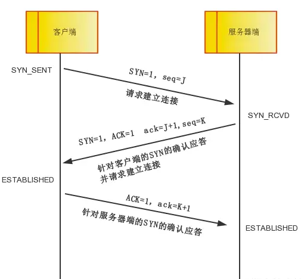
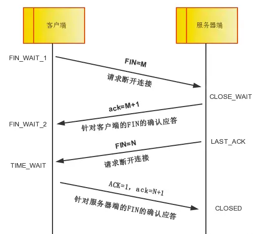
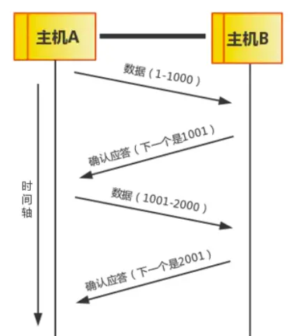
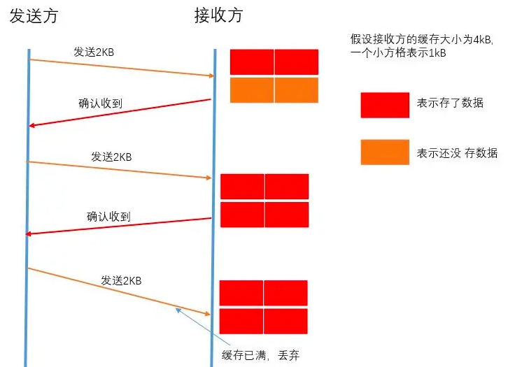
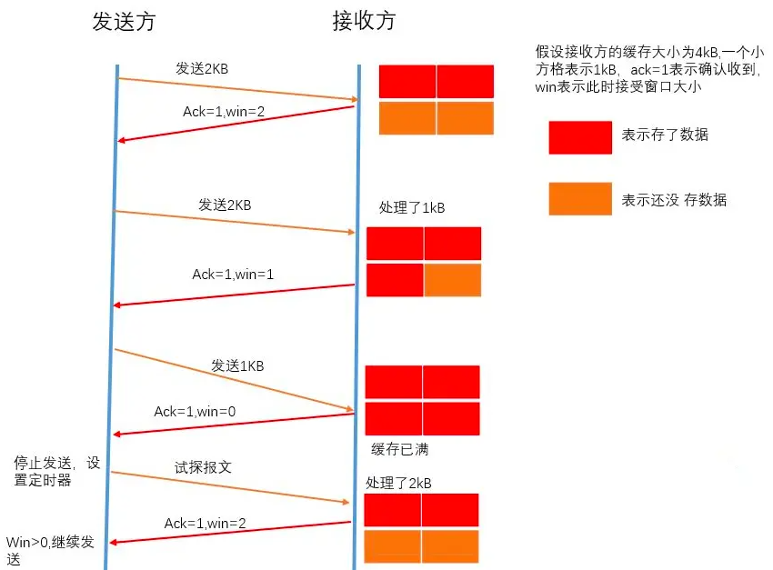
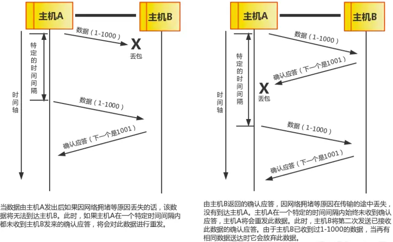

## HTTP
### 浏览器从输入网址都看到网页都发生了什么？

4.1、域名解析成ip地址

4.2、客户端发送一个带有SYN标志的数据包给服务端（三次握手，第一次）

4.3、服务端收到后，回传一个带有SYN/ACK标志的数据包以示传达确认信息（三次握手，第二次）

4.4、客户端再回传一个带ACK标志的数据包，代表握手结束，连接成功（三次握手，第三次）

4.5、服务端处理数据并返回数据

4.6、客户端请求关闭连接（四次挥手，第一次）

4.7、服务端确认是否还有数据要传输（四次挥手，第二次）

4.8、服务端没有要传输的数据了，准备关闭连接（四次挥手，第三次）

4.9、客户端断开连接（四次挥手，第四次）

4.10、浏览器解析HTML，生成DOM树，解析CSS，生成CSS规则树

4.11、DOM树和CSS规则树合并成渲染树，开始渲染

4.12、执行JavaScript脚本

### 状态码

  1字头：信息，服务器收到请求，需要请求者继续执行操作
  
  2字头：成功，操作被成功接收并处理

  3字头：重定向，需要进一步的操作以完成请求

  4字头：客户端错误，请求包含语法错误或无法完成请求

  5字头：服务器错误，服务器在处理请求的过程中发生了错误
```
  101：切换协议。
  200：请求成功。一般用于GET与POST请求
  203：非授权信息。请求成功。但返回的meta信息不在原始的服务器，而是一个副本
  204：无内容。服务器成功处理，但未返回内容。
  301：永久移动。请求的资源已被永久的移动到新URI，返回信息会包括新的URI，浏览器会自动定向到
  新URI。
  302：临时移动。
  304：未修改。所请求的资源未修改，服务器返回此状态码时，不会返回任何资源。
  305：使用代理。所请求的资源必须通过代理访问
  307：临时重定向。
  400：客户端请求的语法错误，服务器无法理解
  404：服务器无法根据客户端的请求找到资源（网页）
  405：客户端请求中的方法被禁止
  500：服务器内部错误，无法完成请求
  502：作为网关或者代理工作的服务器尝试执行请求时，从远程服务器接收到了一个无效的响应
  503：由于超载或系统维护，服务器暂时的无法处理客户端的请求。
  505：服务器不支持请求的HTTP协议的版本，无法完成处理
```
### POST和GET区别

GET在浏览器回退时是无害的，而POST会再次提交请求。

GET产生的URL地址可以被Bookmark(收藏为书签)，而POST不可以。

GET请求会被浏览器主动cache(能被缓存)，而POST不会，除非手动设置。

GET请求只能进行url编码application/x-www-form-urlencoded，
而POST支持多种编码方式application/x-www-form-urlencoded or multipart/form-data。二进制多重编码

GET请求参数会被完整保留在浏览器历史记录里，而POST中的参数不会被保留。

GET请求在URL中传送的参数是有长度限制的，而POST没有。

对参数的数据类型，GET只接受ASCII字符，而POST没有限制。

GET比POST更不安全，因为参数直接暴露在URL上，所以不能用来传递敏感信息。

GET参数通过URL传递，POST放在Request body中

### PATCH和PUT

PATCH一般是用来局部更新资源的，假设我们有一个UserInfo，里面有userId， userName， userGender等10个字段，只传一个userName到指定资源去，表示该请求是一个局部更新，后端仅更新接收到的字段。

PUT虽然也是更新资源，但要求前端提供的一定是一个完整的资源对象，理论上说，如果你用了PUT，但却没有提供完整的UserInfo，那么缺了的那些字段应该被清空.另外PUT会有一个create操作,加入更新的id不存在,会进行创建,而PATCH则没有这个.


### http1.0 、http1.1和http2.0的区别

  1、长链接
  HTTP 1.0需要使用keep-alive参数来告知服务器端要建立一个长连接，而HTTP1.1默认支持长连接。
  HTTP是基于TCP/IP协议的，创建一个TCP连接是需要经过三次握手的,有一定的开销，如果每次通讯都要
  重新建立连接的话，对性能有影响。因此最好能维持一个长连接，可以用个长连接来发多个请求。

  2、节约带宽
  HTTP 1.1支持只发送header信息(不带任何body信息)，如果服务器认为客户端有权限请求服务器，则返
  回100，否则返回401。客户端如果接受到100，才开始把请求body发送到服务器。
  这样当服务器返回401的时候，客户端就可以不用发送请求body了，节约了带宽。

  3、HOST域
  HTTP1.0没有host域，HTTP1.1有host域。HOST域就是，web server上的多个虚拟站点可以共享同一个
  ip和端口

  4、多路复用
  HTTP2.0使用了多路复用的技术，做到同一个连接并发处理多个请求，而且并发请求的数量比HTTP1.1
  大了好几个数量级

  5、数据压缩
  HTTP1.1不支持header数据的压缩，HTTP2.0使用HPACK算法对header的数据进行压缩，这样数据体积
  小了，在网络上传输就会更快。

  6、服务器推送
  当我们对支持HTTP2.0的web server请求数据的时候，服务器会顺便把一些客户端需要的资源一起推送
  到客户端，免得客户端再次创建连接发送请求到服务器端获取。这种方式非常合适加载静态资源。服务
  器端推送的这些资源其实存在客户端的本地，客户端直接从本地加载这些资源就可以了，不用走网络，
  速度自然是快很多的。

### TCP和UDP的区别

  （1）TCP是面向连接的，udp是无连接的即发送数据前不需要先建立链接。
  （2）TCP提供可靠的服务。也就是说，通过TCP连接传送的数据，无差错，不丢失，不重复，且按序到
  达;UDP尽最大努力交付，即不保证可靠交付。并且因为tcp可靠，面向连接，不会丢失数据因此适合大
  数据量的交换。
  （3）TCP是面向字节流，UDP面向报文，并且网络出现拥塞不会使得发送速率降低（因此会出现丢包，
  对实时的应用比如IP电话和视频会议等）。
  （4）TCP只能是1对1的，UDP支持1对1,1对多。
  （5）TCP的首部较大为20字节，而UDP只有8字节。
  （6）TCP是面向连接的可靠性传输，而UDP是不可靠的。


TCP和UDP的区别,TCP如何保证可靠性

TCP 是面向连接的、可靠的字节流流协议，多数应用在HTTP，FTP，SMTP等地方；UDP面向报文，主要应用在DNS

数据报的大小应限制在64k以内

TCP三次握手和四次挥手

*SYN* (synchronize)是请求同步的意思  ACK*是*确认同步的意思 Sequence number(顺序号码) Acknowledge number(确认号码)

第一次握手：主机A发送位码为syn＝1，随机产生seq number=1234567的数据包到服务器，主机B由SYN=1知道，A要求建立联机；

第二次握手：主机B收到请求后要确认联机信息，向A发送ack number=(主机A的seq+1)，syn=1，ack=1，随机产生seq=7654321的包；

第三次握手：主机A收到后检查ack number是否正确，即第一次发送的seq number+1，以及位码ack是否为1，若正确，主机A会再发送ack number=(主机B的seq+1)，ack=1，主机B收到后确认seq值与ack=1则连接建立成功。




1. A发，B收。B知道A能发

2. B发，A收。A知道B能发收

3. A发，B收。B知道A能收

   
   客户端发送断开标志FIN=M，告知服务端我发送完毕请求断开了。
   服务端发送ack=M+1，告知客户端我知道你发送完毕了。
   当服务端接受完毕后，发送断开标志FIN=N，告知客户端我接受完毕，请求断开。
   客户端接受后，ack标志=N+1表示我收到了你的断开请求，发送确认标志ACK，表示我可以了。

   1. 第一次挥手 服务端知道客户端发完了
   2. 第二次挥手 客户端知道服务端知道了
   3. 第三次挥手 客户端知道服务端接收完了
   4. 第四次挥手 服务端知道客户端知道接受完了

意外：波动、速度、丢包

1、顺序控制



ack序列号

2、流量控制



设置窗格，告诉发送方自己的缓存区还剩余多少是空闲的，用变量win来表示接收窗口的大小。

发送方收到之后，便会调整自己的发送速率，也就是调整自己发送窗口的大小，当发送方收到接收窗口的大小为0时，发送方就会停止发送数据，防止出现大量丢包情况的发生。



当发送方收到接受窗口 win = 0 时，这时发送方停止发送报文，并且同时开启一个定时器，每隔一段时间就发个测试报文去询问接收方，打听是否可以继续发送数据了，如果可以，接收方就告诉他此时接受窗口的大小；如果接受窗口大小还是为0，则发送方再次刷新启动定时器。

3、拥塞控制

TCP 引入了窗口这个概念，确认应答不再是以每个分段，而是以更大的单位进行确认，转发时间将会被大幅地缩短。也就是说，发送端主机，在发送了一个段以后不必要一直等待确认应答，而是继续发送。


4、超时重发



TCP是**端到端**传输的，同时TCP连接是可**复用**的。什么叫复用呢？复用就是一条连接可以供一台主机上的多个进程使用。**多个进程**使用一个TCP连接，此时**多种不同结构**的数据进到TCP的流式传输，边界分割肯定会出这样或者那样的问题。

如果利用tcp每次发送数据，就与对方建立连接，然后双方发送完一段数据后，就关闭连接，这样就不会出现粘包问题


### websocket和http

websocket是HTML5中的协议，支持持久连接；而Http协议不支持持久连接。

websocket连接建立之后，通信双方都可以在任何时刻向另一方发送数据

双向通信协议，是建立在TCP之上，节省了很多TCP连接建立和断开的消耗，还节约了带宽，后续数据都以帧序列的形式传输

1、浏览器、服务器建立TCP连接，三次握手。这是通信的基础，传输控制层，若失败后续都不执行。
2、TCP连接成功后，浏览器通过HTTP协议向服务器传送WebSocket支持的版本号等信息。（开始前的HTTP握手）服务器收到客户端的握手请求后，同样采用HTTP协议回馈数据。
3、连接成功后，双方通过TCP通道进行数据传输，不需要HTTP协议。

### HTTPS 和 HTTP 的区别
HTTPS 经由 HTTP 进行通信，但利用 SSL/TLS 来加密数据包

HTTPS 默认工作在 TCP 协议443端口，它的工作流程一般如以下方式：

- 1、TCP 三次同步握手，请求网站，服务端生成公匙和私匙
- 2、客户端验证服务器数字证书
- 3、DH 算法协商对称加密算法的密钥、hash 算法的密钥
- 4、SSL 安全加密隧道协商完成， ssl 握手需要的 9 个包
- 5、网页以加密的方式传输，用协商的对称加密算法和密钥加密，保证数据机密性；用协商的hash算法进行数据完整性保护，保证数据不被篡改。（对称加密）


### localStorge实现响应式

利用Vue框架，把变化的数据绑定到computed计算属性上，在实际开发中一般结合Vuex实现Vuex状态持久化
#### Vuex 实现状态持久化
```javascript
  mutaions: {
    markVideoPlayed(state) {
      state.isplayed = true

      window.localStorge.isplayed = JSON.stringify(true)
    },
    setPlayStatus(state, status) {
      state.isplayed = status
    }
  }

  actions: {
    loadVideoStatus({ commit }) {
      let viodeStatus = JSON.parse(window.localStorge.isPlayed)
      commit('setPlayStatus', videoStastus)
    }
  }
```
### localStorge可以跨域吗

浏览器相同tab下的localStorge是否可以共享，Cookie

localStorage和 sessionStorage的主要区别是：localStorage的生命周期是永久的，意思就是如果不主动清除，存储的数据将一直被保存。而sessionStorage顾名思义是针对一个session的数据存储，生命周期为当前窗口，一旦窗口关闭，那么存储的数据将被清空。

```javascript
#localStorage和sessionStorage的一些方法：
#添加键值对： setItem(key,value);
#获取键值对： getItem(key);
#删除键值对： removeItem(key);
#清除所有键值对： clear();
#获取属性名称（键名称）： key(index);
#获取键值对的数量： length;

#localStorage 的存取方式
localStorage.age = 88; // 用localStorage属性的方式来添加条目
localStorage.setItem("animal","cat"); // 推荐使用setItem的方式存储一个名为animal，值为cat的数据
var animal = localStorage.getItem("animal"); //读取本地存储中名为animal的数据，并赋值给变量animal
console.log(animal);  
localStorage.removeItem("animal"); //删除单条数据
localStorage.clear(); //清除所有数据

#sessionStorage 的存取方式
sessionStorage.work = "police";
sessionStorage.setItem("person", "Li Lei");
var person = sessionStorage.getItem("person");
console.log(person);
```

跨域目前广泛采用的是postMessage和iframe相结合的方法。postMessage(data,origin)方法允许来自不同源的脚本采用异步方式进行通信，可以实现跨文本档、多窗口、跨域消息传递。接受两个参数：

data：要传递的数据，HTML5规范中提到该参数可以是JavaScript的任意基本类型或可复制的对象，然而并不是所有浏览器支持任意类型的参数，部分浏览器只能处理字符串参数，所以在传递参数时需要使用JSON.stringify()方法对对象参数序列化。

origin：字符串参数，指明目标窗口的源，协议+主机+端口号[+URL]，URL会被忽略，所以可以不写，只是为了安全考虑，postMessage()方法只会将message传递给指定窗口，当然也可以将参数设置为"*"，这样可以传递给任意窗口，如果要指定和当前窗口同源的话设置为"/"。

window.frames[0].postMessage('jogging, reading and writing','http://www.test2.com');


### 跨页面通信
#### 一、同源页面间的跨页面通信

**LocalStorage**
当 LocalStorage 变化时，会触发storage事件。利用这个特性，我们可以在发送消息时，把消息写入到某个 LocalStorage 中；然后在各个页面内，通过监听storage事件即可收到通知。

**IndexedDB 或 cookie**
与 Shared Worker 方案类似，消息发送方将消息存至 IndexedDB 中；接收方（例如所有页面）则通过轮询去获取最新的信息。

**window.open + window.opener**
当我们使用window.open打开页面时，方法会返回一个被打开页面window的引用。而在未显示指定noopener时，被打开的页面可以通过window.opener获取到打开它的页面的引用 —— 通过这种方式我们就将这些页面建立起了联系（一种树形结构）。

**通过 WebSocket与其他“服务器推”技术**
基于服务端

**BroadCast Channel**
可以帮我们创建一个用于广播的通信频道。当所有页面都监听同一频道的消息时，其中某一个页面通过它发送的消息就会被其他所有页面收到。

**Service Worker**
我们会使用轮询的方式让 Shared Worker 支持两种消息。一种是 post，Shared Worker 收到后会将该数据保存下来；另一种是 get，Shared Worker 收到该消息后会将保存的数据通过postMessage传给注册它的页面。也就是让页面通过 get 来主动获取（同步）最新消息。

#### 二、非同源页面之间的通信

可以使用一个用户不可见的 iframe 作为“桥”。由于 iframe 与父页面间可以通过指定origin来忽略同源限制，因此可以在每个页面中嵌入一个 iframe

[更多](https://juejin.cn/post/6844903811232825357)

### IndexDB

LocalStorage是用key-value键值模式存储数据，但跟IndexedDB不一样的是，它的数据并不是按对象形式存储。它存储的数据都是字符串形式。如果你想让LocalStorage存储对象，你需要借助JSON.stringify()能将对象变成字符串形式，再用JSON.parse()将字符串还原成对象

存储限制取决于硬盘大小

### cookie 跨域
域名b.baidu.com获取域名a.baidu.com存储的cookie，涉及到跨域，给cookie设置domain属性即可。

```
document.cookie="name=value;path=path;domain=baidu.com"
```

domain属性规定cookie的跨域范围，可以实现cookie被baidu.com或其子域名访问。

path默认为其根目录，path=/
## 计算机网络原理

### 网络层次划分
- 应用层

- - DNS域名系统 ​ 

- - HTTP协议

- - URL、FTP文本传输协议

- - HTTP和FTP的异同：​

- - 电子邮件​

- - WWW服务​

- - URL统一资源定位符

- 表示层 （五层没有）

- 会话层 （五层没有）

- 传输层

- - TCP​

- - - TCP三次握手过程

- - - TCP四次挥手过程

- - - 谈下你对流量控制的理解？
> 在 TCP 链接中，对于发送端和接收端而言，TCP 需要把发送的数据放到发送缓存区, 将接收的数据放到接收缓存区。而经常会存在发送端发送过多，而接收端无法消化的情况，所以就需要流量控制，就是在通过接收缓存区的大小，控制发送端的发送。如果对方的接收缓存区满了，就不能再继续发送了。而这种流量控制的过程就需要在发送端维护一个发送窗口，在接收端维持一个接收窗口。

- - - - 谈下你对 TCP 拥塞控制的理解？使用了哪些算法？
> 慢开始、拥塞避免、快重传和快恢复

- - - - UDP用户报文协议

- 网络层

- - IP地址

- - 特殊地址 

- - 地址解析协议ARP

- 数据链路层 （与物理层通常称为网络接口层）

- - 谈谈你对停止等待协议的理解？

- - 谈谈你对 ARQ 协议的理解？

- - 谈谈你对滑动窗口的了解？

- 物理层

### Fetch API与传统Request的区别

fetch 符合关注点分离，使用 Promise，API 更加丰富，支持 Async/Await

语意简单，更加语意化

可以使用 isomorphic-fetch ，同构方便

### HTTP 如何实现长连接?在什么时候会超时?

通过在头部(请求和响应头)设置 Connection: keep-alive，HTTP1.0协议支持，但是默认关闭，从HTTP1.1协议以后，连接默认都是长连接

- HTTP 一般会有 httpd 守护进程，里面可以设置 keep-alive timeout，当 tcp 链接闲置超过这个时间就会关闭，也可以在 HTTP 的 header 里面设置超时时间
- TCP 的 keep-alive 包含三个参数，支持在系统内核的 net.ipv4 里面设置：当 TCP 链接之后，闲置了 tcp_keepalive_time，则会发生侦测包，如果没有收到对方的 ACK，那么会每隔 tcp_keepalive_intvl 再发一次，直到发送了 tcp_keepalive_probes，就会丢弃该链接。

  1、tcp_keepalive_intvl = 15

  2、tcp_keepalive_probes = 5

  3、tcp_keepalive_time = 1800

实际上 HTTP 没有长短链接，只有 TCP 有，TCP 长连接可以复用一个 TCP 链接来发起多次 HTTP 请求，这样可以减少资源消耗，比如一次请求 HTML，可能还需要请求后续的 JS/CSS/图片等

### WebSocket与Ajax的区别

本质不同
Ajax 即异步 JavaScript 和 XML，是一种创建交互式网页的应用的网页开发技术

websocket 是 HTML5 的一种新协议，实现了浏览器和服务器的实时通信

生命周期不同：

websocket 是长连接，会话一直保持

ajax 发送接收之后就会断开

适用范围：

websocket 用于前后端实时交互数据
ajax 非实时
发起人：

AJAX 客户端发起
WebSocket 服务器端和客户端相互推送

### 了解 WebSocket 吗

长轮询和短轮询，WebSocket 是长轮询。

具体比如在一个电商场景，商品的库存可能会变化，所以需要及时反映给用户，所以客户端会不停的发请求，然后服务器端会不停的去查变化，不管变不变，都返回，这个是短轮询。

而长轮询则表现为如果没有变，就不返回，而是等待变或者超时(一般是十几秒)才返回，如果没有返回，客户端也不需要一直发请求，所以减少了双方的压力。

### 跨域
同源协议是指"协议+域名+端口"三者相同

方法1：跨域资源共享CORS跨域，就是服务端在HTTP返回头上加上“AccessControll-Allow-Origin：
*”。 “Access-Controll-Allow-METHODS：GET, POST” DELETE、PATCH请求类型会发出OPTIONS预检
请求。

方法2：代理跨域，webpack-dev-server里面的proxy配置项。config中的 ProxyTable

方法3：JSONP，利用页面srcipt没有跨域限制的漏洞，用script的src引入它，然后页 面内定义回调函
数，jQuery中$.ajax({dataType: ‘jsonp’})。

方法4： iframe跨域，配合window.name或者 location.hash或者document.domain 一起使用

方法5：nginx反向代理接口跨域，通过nginx配置一个代理服务器（域名与domain1 相同，端口不同）
做跳板机，反向代理访问domain2接口，并且可以顺便修改cookie中 domain信息，方便当前域cookie
写入，实现跨域登录。
方法6：jquery的ajax跨域，dataType:'jsonp

### ajax实现原理
浏览器提供的XMLHttpRequest对象，可以让浏览器发出HTTP请求和接收HTTP响应。
```javascript
// 手写一个简单的Ajax

// 结合Promise
function Ajax(url) {
  const p = new Promise((resolve, reject) => {
    const xhr = new XMLHttpRequest();
    xhr.open('GET', url, false);
    xhr.onreadystatechange = function () {
      if (xhr.readyState === 4) {
        // 这里的 status 可以适当修改
        if (xhr.status === 200) {
          resolve(
            // 将得到 responseText 转换为JSON格式数据
            JSON.parse(xhr.responseText)
          );
        } else if (xhr.status === 404) {
          reject(new Error('404 not found'))
        }
      }
    }
    xhr.send(null);
  });
  return p;
}
const url = './data/test.json';
Ajax(url).then(res => console.log(res)).catch(err => console.err(err))

```
若想设置POST请求版，则需更改

xhr.open里的参数为`xhr.open('POST', url, true/false);`

xhr.send里的参数为`xhr.send(p);`

### 图片懒加载

方案一: 位置计算 + 滚动事件 (Scroll) + DataSet API
clientTop，offsetTop，clientHeight 以及 scrollTop 各种关于图片的高度作比对
监听 window.scroll 事件
```html

```

方案二: getBoundingClientRect API + Scroll with Throttle + DataSet API

window.scroll 监听 Element.getBoundingClientRect() 并使用 _.throttle 节流

方案三: IntersectionObserver API + DataSet API
其中，entry.isIntersecting 代表目标元素可见
```javascript
const observer = new IntersectionObserver((changes) => {
  // changes: 目标元素集合
  changes.forEach((change) => {
    // intersectionRatio
    if (change.isIntersecting) {
      const img = change.target;
      img.src = img.dataset.src;
      observer.unobserve(img);
    }
  });
});

observer.observe(img);
```
当然，IntersectionObserver 除了给图片做懒加载外，还可以对单页应用资源做预加载。

方案四: LazyLoading 属性
```html

```
首先设置一个临时 Data 属性 data-src，控制加载时使用 src 代替 data-src，可利用 DataSet API 实现
### XSS攻击和CSRF攻击
XSS：跨站脚本攻击Cross site script，因叫css容易让人误会所以改成了xss。比如一个JSON数据：
在不该出现script代码的地方出现了，引发一些潜在的危险。 XSS漏洞，能让人们在网页里面插入一段有
功能的语句。 XSS 全称“跨站脚本”，是注入攻击的一种。其特点是不对服务器端造成任何伤害， 而是通
过一些正常的站内交互途径，例如发布评论，提交含有 JavaScript 的内容文本。这时服务器端如果没有
过滤或转义掉这些脚本，作为内容发布到了页面上，其他用户访问这个 页面的时候就会运行这些脚本。
防范： ① 用正则表达式阻止用户提交带有<、eval、script等危险字眼的语句 ② 显示的时候不要直接用
innerHTML，而是用innerText，或者将<转义。
```json
var obj = [ { id: 1, name: "<script>alert('哈哈哈')</script>", age: 12, } ];
```
CSRF 的全称是“跨站请求伪造”，而 XSS 的全称是“跨站脚本”。看起来有点相 似，它们都是属于跨站攻击
——不攻击服务器端而攻击正常访问网站的用户，但前面说 了，它们的攻击类型是不同维度上的分类。
CSRF 顾名思义，是伪造请求，冒充用户在站内 的正常操作。我们知道，绝大多数网站是通过 cookie 等
方式辨识用户身份(包括使用服务 器端 Session 的网站，因为 Session ID 也是大多保存在 cookie 里面
的)，再予以授权的。 所以要伪造用户的正常操作，最好的方法是通过 XSS 或链接欺骗等途径，让用户
在本机(即 拥有身份 cookie 的浏览器端)发起用户所不知道的请求。 就是说，如果用户不老老实实写姓
名，写了一个个叫做XSS。如果进一步的，写了一个$.post()发了document.cookie就是CSRF了。解决方
法： ① 用token验证，验证用户的IP地址生成MD5码，更安全的验证方法 ② 防住XSS。

### POST一般可以发送什么类型的文件，数据处理的问题

文本、图片、视频、音频等都可以

text/image/audio/ 或 application/json 等

### OPTION是干啥的?举个用到OPTION的例子?

旨在发送一种探测请求，以确定针对某个目标地址的请求必须具有怎么样的约束，然后根据约束发送真正的请求。

比如针对跨域资源的预检，就是采用 HTTP 的 OPTIONS 方法先发送的。用来处理跨域请求

### http知道嘛?哪一层的协议?(应用层)

超文本传输协议（Hyper Text Transfer Protocol，HTTP）是一个简单的请求-响应协议，它通常运行在TCP之上

灵活可扩展，除了规定空格分隔单词，换行分隔字段以外，其他都没有限制，不仅仅可以传输文本，还可以传输图片、视频等任意资源
可靠传输，基于 TCP/IP 所以继承了这一特性
请求-应答，有来有回
无状态，每次 HTTP 请求都是独立的，无关的、默认不需要保存上下文信息
缺点：

明文传输不安全
复用一个 TCP 链接，会发生对头拥塞
无状态在长连接场景中，需要保存大量上下文，以避免传输大量重复的信息

### 请求头响应头

先看通用信息，通用信息有三个字段： 请求url地址， 请求方法， 状态码。

看下请求头Request Headers，

（1）Accept : 指定客户端能够接收的内容类型，内容类型中的先后次序表示客户端接收的先后次序。在Ajax代码中，可以使用XMLHttpRequest 对象中setRequestHeader函数方法来动态设置这些Header信息。

（2）Accept-Encoding : 指定客户端浏览器可以支持的web服务器返回内容压缩编码类型。表示允许服务器在将输出内容发送到客户端以前进行压缩，以节约带宽。而这里设置的就是客户端浏览器所能够支持的返回压缩格式。

（3）Accept-Language : 指定HTTP客户端浏览器用来展示返回信息所优先选择的语言。

（4）Connection ： 表示是否需要持久连接。如果web服务器端看到这里的值为“Keep-Alive”，或者看到请求使用的是HTTP 1.1（HTTP 1.1默认进行持久连接），它就可以利用持久连接的优点，当页面包含多个元素时（例如Applet，图片），显著地减少下载所需要的时间。要实现这一点， web服务器需要在返回给客户端HTTP头信息中发送一个Content-Length（返回信息正文的长度）头，最简单的实现方法是：先把内容写入ByteArrayOutputStream，然 后在正式写出内容之前计算它的大小。

（5）Connec-Length : 请求头的长度。

（6）Connect-Type : 显示此HTTP请求提交的内容类型。一般只有post提交时才需要设置该属性。

（7）有关Content-Type属性值可以如下两种编码类型：

1. “application/x-www-form-urlencoded”： 表单数据向服务器提交时所采用的编码类型，默认的缺省值就是“application/x-www-form-urlencoded”。
然而，在向服务器发送大量的文本、包含非ASCII字符的文本或二进制数据时这种编码方式效率很低。

2. “multipart/form-data”： 在文件上载时，所使用的编码类型应当是“multipart/form-data”，它既可以发送文本数据，也支持二进制数据上载。

当提交为单单数据时，可以使用“application/x-www-form-urlencoded”；当提交的是文件时，就需要使用“multipart/form-data”编码类型。

在Content-Type属性当中还是指定提交内容的charset字符编码。一般不进行设置，它只是告诉web服务器post提交的数据采用的何种字符编码。

（9）cookie : 浏览器端cookie。

（9）Hose : 客户端地址

（10）Origin : 目标地址

（11）Referer : 包含一个URL，用户从该URL代表的页面出发访问当前请求的页面

（12）User-Agent : 客户端信息

（13）x－Requested-With : 是否为同步请求 ，如果为XMLHttpRequest，则为 Ajax 异步请求。如果为null则为传统同步请求


响应头Response Header 由于实例中的返回的字段并不是很全，就从网络上找了下全面的响应头信息

响应头	作用	参数
Accept-Ranges	表明服务器是否支持指定范围请求及哪种类型的分段请求	Accept-Ranges: bytes

Age	从原始服务器到代理缓存形成的估算时间（以秒计，非负）	Age: 12

Allow	对某网络资源的有效的请求行为，不允许则返回405	Allow: GET, HEAD

Cache-Control	告诉所有的缓存机制是否可以缓存及哪种类型	Cache-Control: no-cache

Content-Encoding	web服务器支持的返回内容压缩编码类型。	

Content-Encoding: gzip

Content-Language	响应体的语言	Content-Language: en,zh

Content-Length	响应体的长度	Content-Length: 348

Content-Location	请求资源可替代的备用的另一地址	Content-Location: /index.htm

Content-MD5	返回资源的MD5校验值	Content-MD5: Q2hlY2sgSW50ZWdyaXR5IQ==

Content-Range	在整个返回体中本部分的字节位置	Content-Range: bytes 21010-47021/47022

Content-Type	返回内容的MIME类型	Content-Type: text/html; charset=utf-8

Date	原始服务器消息发出的时间	Date: Tue, 15 Nov 2010 08:12:31 GMT

ETag	请求变量的实体标签的当前值	ETag: “737060cd8c284d8af7ad3082f209582d”

Expires	响应过期的日期和时间	Expires: Thu, 01 Dec 2010 16:00:00 GMT

Last-Modified	请求资源的最后修改时间	Last-Modified: Tue, 15 Nov 2010 12:45:26 GMT

Location	用来重定向接收方到非请求URL的位置来完成请求或标识新的资源	Location: http://www.zcmhi.com/archives/94.html

Pragma	包括实现特定的指令，它可应用到响应链上的任何接收方	Pragma: no-cache

Proxy-Authenticate	它指出认证方案和可应用到代理的该URL上的参数	

Proxy-Authenticate: Basic
refresh	应用于重定向或一个新的资源被创造，在5秒之后重定向（由网景提出，被大部分浏览器支持）	Refresh: 5; url=
http://www.zcmhi.com/archives/94.html		

Retry-After	如果实体暂时不可取，通知客户端在指定时间之后再次尝试	Retry-After: 120

Server	web服务器软件名称	Server: Apache/1.3.27 (Unix) (Red-Hat/Linux)

Set-Cookie	设置Http Cookie	Set-Cookie: UserID=JohnDoe; 
Max-Age=3600; Version=1

Trailer	指出头域在分块传输编码的尾部存在	Trailer: Max-Forwards

Transfer-Encoding	文件传输编码	Transfer-Encoding:chunked Vary

Via	告知代理客户端响应是通过哪里发送的	Via: 1.0 fred, 1.1 nowhere.com (Apache/1.1)

Warning	警告实体可能存在的问题	Warning: 199 Miscellaneous warning

WWW-Authenticate	表明客户端请求实体应该使用的授权方案	

WWW-Authenticate: Basic

### 那么独立负责项目的测试上线，你需要做什么呢

```
1、需求评审，确认研发计划。编写测试计划、测试方案。
2、先根据产品的需求文档+自己对当前行业的了解，拆分测试点。拆分测试点的过程中，把遇到的不清晰的需求（或者技术方面，不理解的知识点），通过问产品/开发/搜索引擎检索/查阅公司内部资料，搞定 。
根据自己梳理完成的最终测试点，开始设计测试用例、进行用例评审（或是测试点评审）。
3、测试执行过程中 ，问题提交Bug系统，对提交的bug进行跟进、回归。
4、关注风险/延期 ，以及 质量/进度的平衡，及时反馈。
5、完成测试，提交测试报告。
6、开始发布、上线（或有灰度发布流程。记得把上线的步骤，自己用文档，完整的记录下来，并模拟几次，确保无遗漏）。
7、进行生产环境测试
8、上线后，核心业务的日志、数据监控
9、上线后，线上问题反馈流程。
10、上线后的值班。
11、项目复盘（总结会）
```